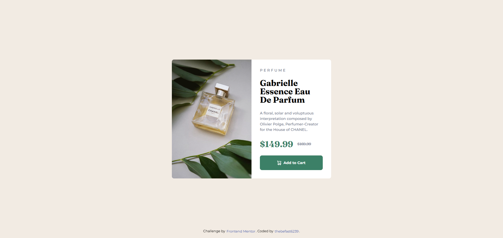

# Frontend Mentor - Product preview card component solution

This is a solution to the [Product preview card component challenge on Frontend Mentor](https://www.frontendmentor.io/challenges/product-preview-card-component-GO7UmttRfa). Frontend Mentor challenges help you improve your coding skills by building realistic projects. 

## Table of contents

- [Overview](#overview)
  - [Screenshot](#screenshot)
  - [Links](#links)
- [My process](#my-process)
  - [Built with](#built-with)
  - [What I learned](#what-i-learned)
  - [Continued development](#continued-development)
  - [Useful resources](#useful-resources)
- [Author](#author)
- [Acknowledgments](#acknowledgments)

## Overview

### Screenshot



### Links

- Solution URL: [github repo](https://github.com/thebefast6239/product-preview-card-component-main)
- Live Site URL: [github io](https://github.io/thebefast6239/product-preview-card-component-main)

## My process

### Built with

- Semantic HTML5 markup
- CSS custom properties
- Flexbox
- Mobile-first workflow


### What I learned

Used <source srcset="#"> attribute
```html
<div class="product-preview">
    <picture>
        <source media="(max-width: 1024px)" srcset="images/image-product-mobile.jpg">
        
    </picture>
</div>
```

Used vertical-align and transition for a cool effect.
```css
.attribution a{
    display: inline-block;
    transition: font-size 0.25s ease, color 0.25s ease;
    vertical-align: middle
}
```
learned new properties for flex -> justify-content
```css
.test{
    justify-content: space-around;
    justify-content: space-between;
}
```

## Author

- Website - [thebefast6239](https://github.com/thebefast6239)
- Discord - [a0s9d8f7g6h5j4k3l2](https://discord.gg)